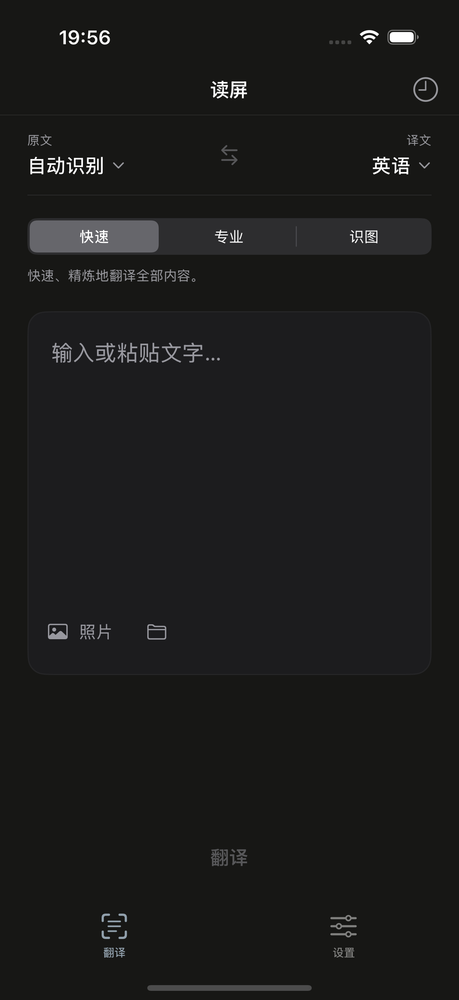
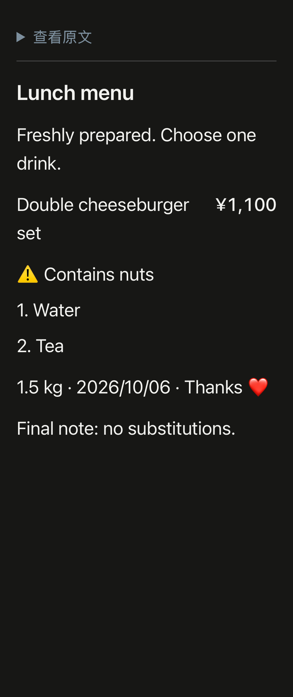

# 读屏 · Screenreader

> [!IMPORTANT]
> **本 APP 由 GPT-6Astra 开发完成。**

读屏是一款面向 iPhone 的截图、文字与图片内容翻译 App。长按操作按钮即可截屏、翻译并打开可滚动的全文窗口，也可以在 App 内输入文字、导入照片或图片文件。当前版本为 **1.0.0（构建 17）**，最低支持 **iOS 18**，开发者 **WANG ZIRUI**。

App 界面为中文，支持中文、英语、日语互译与混合语言识别。默认目标语言为英语，默认 API 配置为 DeepSeek / `deepseek-flash`。

## 主要功能

### 三种翻译模式

| 模式 | 适用内容 | 当前功能 |
|---|---|---|
| 快速 | 普通文字、网页和短消息 | 精简 API 翻译，优先速度，保留全文和关键事实；App 内另可选 Apple 系统翻译 |
| 专业 | 菜单、商品、通知与表格 | 保留标题、段落、列表、字段、商品与价格关系，以及表格列归属 |
| 识图 | 照片、海报和难以识字的图片 | 分别说明可辨认文字的大意与整体画面内容，可发送同图局部细节辅助理解 |

可以事先选择默认模式，也可让操作按钮每次询问。识图需要实际支持图片的 API 模型；系统翻译仅支持 App 内快速模式，操作按钮使用 API。

### 识字与专业排版

- 在本机识别截图文字，支持长图切片和模糊区域有限次放大复识别。
- 根据位置及邻近文字处理状态栏、导航图标、装饰和孤立符号，保留有意义的数量、价格、日期、评分、表情和数学符号。
- 专业模式恢复标题层级、正文段落、列表及表格关系，避免商品与价格、数量与库存错位。
- 处理多余换行、标点空格、重复项目符号和无意义的整段 Markdown 包装；保留编号、小数、日期和表情组合。
- 校验专业结果的段落与数字完整性，遇到漏段、关键数字丢失或接口截断时明确报错。

日语场景强化税费、期限、否定、套餐与单品、退款条件、必选项和脚注处理。选择的来源语言会同时用于识字与翻译，目标语言会更新默认指令和提示词变量。

### 操作按钮与全文阅读

已提供完整的 **截屏 → 翻译截图全文 → 快速查看** 快捷指令。结果窗口可上下滚动阅读全文，展开“查看原文”核对识别内容。已有“屏译全文”指令保持兼容。

App 内和全文文稿可设置字号、阅读间距与原文默认展开状态。复制、分享和翻译记录均保留完整译文。

### API 与模式提示词

- 支持 DeepSeek、OpenAI、Gemini、Claude、通义千问及自定义 HTTPS 端点。
- 可选择预设模型、获取模型列表或手动填写模型 ID；实际模型可用性由服务账户决定。
- 支持 Chat Completions、Responses 和 Claude Messages，各服务商分别保存地址、模型与 Keychain 密钥。
- 快速、专业、识图各有独立默认提示词，也可分别填写、保存和重置自定义要求。
- 自定义要求支持 `{source_language}`、`{target_language}`、`{tone}`、`{glossary}` 变量及术语表；系统翻译不使用模型提示词。

### 缓存、记录与外观

相同文字、语言、模式、模型和有效提示词可在 **20 分钟**内复用内存缓存；支持关闭或清除缓存。识图解释不缓存，网络请求不自动重试。

翻译记录仅保存在本机，可保留 **10 / 30 / 100 条**，支持搜索、逐条删除及清空。关闭保存记录并保存设置后，已有记录也会清空。

支持浅色、深色、跟随系统及多种预设或自定义强调色。语言交换带轻量动效与触感反馈。设置首页集中提供翻译、API、模式提示词、外观与阅读、缓存与记录、操作按钮及使用说明。

<table><tr>
<td></td>
<td></td>
</tr></table>

## 安装与开始使用

从 [1.0.0 Release](https://github.com/WZR0821/Screenreader/releases/tag/v1.0.0) 下载 `Screenreader-iOS-v1.0.0-build17-unsigned.ipa`。IPA 为 iPhoneOS arm64 未签名 Release，需要自行签名后安装。

1. 在读屏 **设置 → API 设置** 中选择服务和模型，填写自己的 API Key 并保存。
2. 在 **设置 → 翻译** 中选择来源、目标语言和默认模式，即可在 App 内翻译。
3. 如需长按操作按钮：在 **设置 → 操作按钮 → 安装“读屏全文”** 中添加快捷指令，再到 iPhone **设置 → 操作按钮 → 快捷指令** 选择“读屏全文”。

解锁手机后打开待翻译页面，长按操作按钮，首次按提示授权并滚动阅读全文。没有操作按钮时，可从“快捷指令”App 运行或直接使用 App 内翻译。若重签名改变了应用标识，需要重新连接当前安装 App 的全文翻译动作。详见 [使用指南](Docs/Release-1.0.0/使用指南.md)。

## 数据与隐私

API Key 分服务保存在设备 Keychain。本机记录只保存文字结果，不保存截图；缓存仅在内存中保存。

快速和专业模式只向用户选择的 API 发送识别文字及翻译要求。识图会发送重新编码的图片与同图细节，不复制原图 GPS / 相机元数据。外部服务的数据政策由对应服务商决定。当前没有 App 自建业务服务器、广告或统计 SDK。详见 [隐私与数据处理](Docs/Release-1.0.0/隐私与数据.md)。

## 开发与验证

使用支持 iOS 18 SDK 的 Xcode 打开 `ScreenTranslate.xcodeproj`，选择 `ScreenTranslate` scheme。验证环境为 Xcode 16.2 / iOS 18.2 模拟器。应用使用 SwiftUI、Vision、App Intents 和 Apple Translation，没有第三方包依赖。

```sh
python3 Scripts/generate_project.py
swift test

xcodebuild build -project ScreenTranslate.xcodeproj -scheme ScreenTranslate \
  -configuration Release -sdk iphoneos -destination 'generic/platform=iOS' \
  -derivedDataPath work/DeviceBuild CODE_SIGNING_ALLOWED=NO

python3 Scripts/package_unsigned_ipa.py \
  work/DeviceBuild/Build/Products/Release-iphoneos/ScreenTranslate.app \
  work/Screenreader-iOS-v1.0.0-build17-unsigned.ipa
```

交付记录中，127 项核心测试及 184 个不同 iOS 单元 / 集成、28 个不同 UI 用例的最终结果通过。iOS 数字按基线和定向复测的最后结果去重；构建 17 尚未进行新版真机在线 API 复测。固定响应测试不代表实际模型准确率或真机速度，详见 [验证结果](Docs/Release-1.0.0/验证结果.md)。

## 使用边界

- 翻译范围为提供的截图，不会自动滚动原 App 获取屏外内容。
- 模糊、微小竖排和艺术字可能识别不全；可明确选择识图重试，模型也不应猜补无法辨认的文字。
- 全文窗口使用系统 Quick Look，其关闭工具栏、推荐应用和高度由 iOS 控制。
- Apple 系统翻译在 App 前台运行，可能需要下载语言包；操作按钮使用已配置 API。

完整说明：[功能与开发总结](Docs/Release-1.0.0/开发总结.md) · [使用指南](Docs/Release-1.0.0/使用指南.md) · [架构与 API](Docs/Release-1.0.0/架构与API.md) · [后续路线](Docs/Release-1.0.0/开发路线.md)。

Logo 和合成测试图由内置生图工具生成，具体生图模型版本未披露。测试素材仅用于开发回归。本仓库当前没有指定开源许可证。
